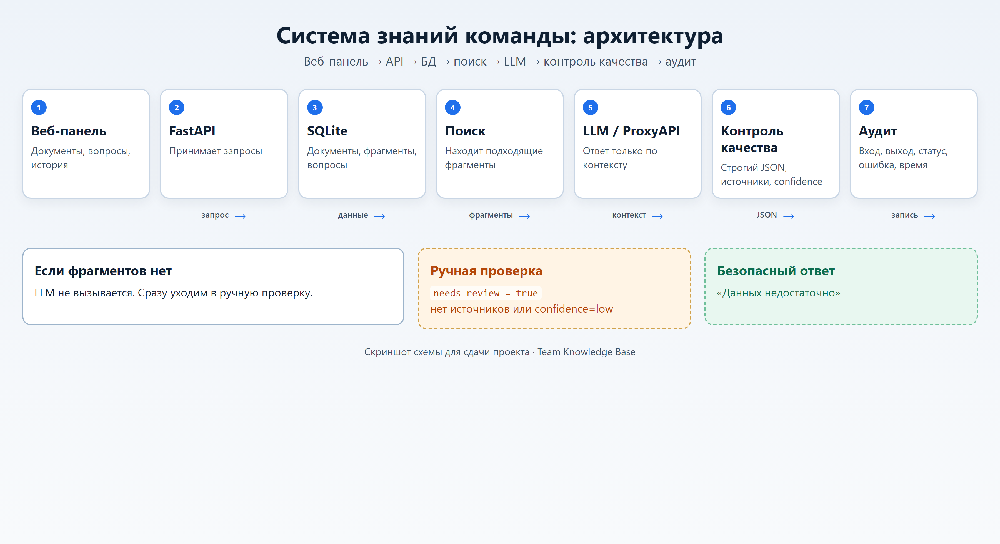

# Система знаний команды

[](https://www.python.org/)
[](https://fastapi.tiangolo.com/)
[](https://www.sqlite.org/)
[](./Dockerfile)
[](./.env.example)
[](./docs/ARCHITECTURE.md)

Веб-панель + FastAPI + SQLite + поиск по фрагментам + LLM (строгий JSON) + ручная проверка + аудит.

Проблема: знания разбросаны, одни и те же вопросы повторяются, опасно додумывать.  
Решение: ответы только по найденным фрагментам с цитатами; иначе `needs_review=true`.  
Результат: витрина документов, Q&A с источниками, история и audit_runs.

Подробная схема: [docs/ARCHITECTURE.md](docs/ARCHITECTURE.md).



## Демо-видео

Смотреть онлайн (Google Диск, со встроенным плеером):  
**https://drive.google.com/file/d/1rKioZOedc6Mt7scPFfQCEV51A9aaZ8Tq/view?usp=sharing**

Файл также лежит в репозитории: [`docs/evidence/demo.webm`](docs/evidence/demo.webm)  
На GitHub у `.webm` часто **нет** предпросмотра — только кнопка Download. Для просмотра удобнее ссылка на Диск выше.

### Видео защиты (5–7 мин)

Смотреть онлайн: **https://drive.google.com/file/d/1GQ2_arv9Wcbe0krzqcHqDMvrvDPOUX9s/view?usp=sharing**

Файл: [`docs/evidence/defense.mp4`](docs/evidence/defense.mp4)  
Голос: Microsoft Edge TTS `ru-RU-DmitryNeural`. Текст: [`docs/evidence/defense_script.md`](docs/evidence/defense_script.md).

Скриншоты и отчёт: [docs/evidence/](docs/evidence/), [docs/REPORT.md](docs/REPORT.md).

## Быстрый старт (≤ 10 минут)

### Вариант A — локально

```bash
python -m venv .venv
# Windows:
.venv\Scripts\activate
# Linux/macOS:
# source .venv/bin/activate

pip install -r requirements.txt
copy .env.example .env
# или: cp .env.example .env

python -m scripts.seed_kb
uvicorn app.main:app --reload --port 8000
```

Если порт 8000 занят: `--port 8001`.

Откройте http://127.0.0.1:8000/ (или выбранный порт).

### Вариант B — Docker

```bash
copy .env.example .env
docker compose up --build
```

Панель: http://127.0.0.1:8000/  
После старта контейнера загрузите тестовые документы:

```bash
docker compose exec kb python -m scripts.seed_kb
```

## Переменные окружения

См. `.env.example`:

| Переменная | Назначение |
|------------|------------|
| `LLM_API_KEY` | Ключ [ProxyAPI](https://proxyapi.ru/). Пусто = offline-режим (extractive) |
| `LLM_BASE_URL` | По умолчанию `https://api.proxyapi.ru/openai/v1` |
| `LLM_MODEL` | Имя модели, например `gpt-4o-mini` |
| `LLM_TEMPERATURE` | Температура (по умолчанию 0.1) |
| `KB_DATABASE_URL` | SQLite, по умолчанию `sqlite:///./data/knowledge.db` |
| `SEARCH_TOP_K` | Сколько фрагментов брать в контекст |

База данных: файл `data/knowledge.db`.  
Аудит: таблица `audit_runs` или `GET /audit/runs`.  
История вопросов: таблица `qa_runs` или вкладка «История» / `GET /qa/runs`.

## Примеры curl

```bash
curl -s -X POST http://127.0.0.1:8000/kb/documents ^
  -H "Content-Type: application/json" ^
  -d "{\"title\":\"Демо\",\"text\":\"Стендап до 10:30.\\n\\nСекреты только в .env.\"}"
```

```bash
curl -s -X POST http://127.0.0.1:8000/kb/ask ^
  -H "Content-Type: application/json" ^
  -d "{\"question\":\"До какого времени нужно провести стендап?\"}"
```

```bash
curl -s -X POST http://127.0.0.1:8000/ai/answer_with_sources ^
  -H "Content-Type: application/json" ^
  -d "{\"question\":\"Что такое needs_review?\",\"context\":\"needs_review — метка ручной проверки.\"}"
```

Linux/macOS: замените `^` на `\` и экранирование кавычек по shell.

## Точки доступа

- `POST /kb/documents` — добавить документ  
- `GET /kb/documents` — витрина  
- `GET /kb/documents/{id}` — карточка документа  
- `POST /kb/ask` — вопрос к базе знаний  
- `POST /ai/answer_with_sources` — ИИ-операция со строгим JSON  
- `GET /qa/runs` — история вопросов (`?needs_review=true`)  
- `GET /audit/runs` — аудит  
- `GET /export/qa?format=json|csv` — экспорт  

## Как воспроизвести ручную проверку

1. Загрузите тестовые документы: `python -m scripts.seed_kb`
2. Задайте вопрос из тестов с `expected_needs_review=true`, например:

```bash
curl -s -X POST http://127.0.0.1:8000/kb/ask ^
  -H "Content-Type: application/json" ^
  -d "{\"question\":\"Какой размер бонуса за лучший мем месяца?\"}"
```

Ожидается: `needs_review=true`, пустые `sources`, ответ про недостаток данных, запись в `qa_runs` и `audit_runs`.

Автопроверка всех 10 вопросов:

```bash
python -m scripts.run_question_checks
```

## Тестовые данные

- `tests_data/kb_documents.jsonl` — 5 документов  
- `tests_data/kb_questions.jsonl` — 10 вопросов (7 с ответом, 3 на review)

### Мини-таблица вопросов

| № | expected_needs_review | Почему | Документ |
|---|----------------------|--------|----------|
| 1 | false | Стендап до 10:30 | Правила работы команды |
| 2 | false | Секреты не в чат/README | Правила работы команды |
| 3 | false | Срок отчёта 2 рабочих дня | Частые вопросы клиентов |
| 4 | false | Действия при задержке | Частые вопросы клиентов |
| 5 | false | Шаблон B | Шаблоны ответов |
| 6 | false | Определение needs_review | Словарь терминов |
| 7 | false | Чеклист запуска/релиза | Процесс запуска задачи |
| 8 | true | Темы нет в базе | — |
| 9 | true | Темы нет в базе (Zogatron) | — |
| 10 | true | Темы нет в базе (Nebula-7) | — |

## Веб-панель

1. **Документы** — форма + витрина + открытие текста  
2. **Вопросы** — спросить → ответ, цитаты, бейдж «требует проверки»  
3. **История** — QA + фильтр review + карточка + audit + экспорт  

## Сдача

| Материал | Ссылка |
|----------|--------|
| Репозиторий | https://github.com/nifontovoleg/ai-team-knowledge-base |
| Отчёт | [docs/REPORT.md](docs/REPORT.md) |
| Демо 2–4 мин | https://drive.google.com/file/d/1rKioZOedc6Mt7scPFfQCEV51A9aaZ8Tq/view?usp=sharing |
| Защита 5–7 мин | https://drive.google.com/file/d/1GQ2_arv9Wcbe0krzqcHqDMvrvDPOUX9s/view?usp=sharing |
| Сценарии записи | [docs/DEMO_AND_DEFENSE.md](docs/DEMO_AND_DEFENSE.md) |

Готовый текст для формы ДЗ — в конце [docs/REPORT.md](docs/REPORT.md#текст-для-сдачи-дз).
