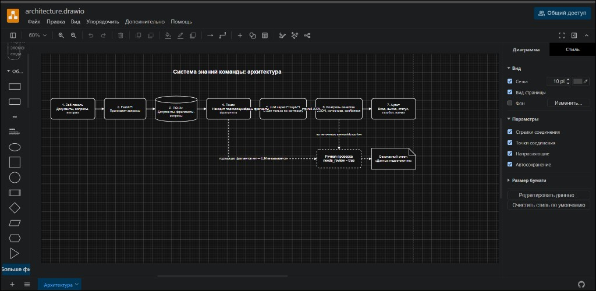

# Журнал разработки

В журнале фиксируются только реально проверенные и подтверждённые контрольные точки. Локальные черновики не считаются завершённым этапом и не включаются в соответствующий Git-коммит до проверки.

## Контрольная точка 1. Постановка задачи и архитектура

Дата: 25 августа 2026 года

Статус: завершено и подтверждено

### Цель

Определить пользователя, ценность проекта, ожидаемый результат и общую архитектуру из 5–7 блоков.

### Выполнено

- выбран проект системы знаний для службы поддержки интернет-магазина;
- определены пользователи и виды внутренних материалов;
- сформулированы проблема, решение и результат;
- согласована архитектура из семи блоков;
- создана редактируемая схема diagrams.net;
- определено правило безопасного ответа: если источников нет, устанавливается `needs_review=true`.

### Артефакты

- `docs/PROJECT_BRIEF.md`;
- `docs/architecture.drawio`;
- `docs/DEVELOPMENT_LOG.md`.

### Проверка

- формулировки согласованы с владельцем проекта;
- файл `architecture.drawio` прошёл проверку корректности XML;
- схема открывается и редактируется в diagrams.net.

### схема diagrams.net

### Следующая контрольная точка

Строгая JSON-схема ИИ-операции и правила ручной проверки зафиксированы в контрольной точке 2.

## Контрольная точка 2. Строгая JSON-схема ИИ-операции

Дата: 25 августа 2026 года

Статус: завершено и подтверждено

### Цель

Зафиксировать проверяемый формат ответа языковой модели и исключить уверенные ответы без источников.

### Выполнено

- определены обязательные поля `answer`, `sources`, `confidence`, `needs_review`;
- запрещены дополнительные поля;
- установлены допустимые значения уверенности: `high`, `medium`, `low`;
- пустой массив `sources` требует `needs_review=true`;
- значение `confidence="low"` требует `needs_review=true`;
- при `needs_review=false` обязателен хотя бы один источник;
- добавлены примеры успешного ответа и ответа для ручной проверки.

### Артефакты

- `docs/ai_answer.schema.json`;
- `docs/DEVELOPMENT_LOG.md`.

### Проверка

- синтаксис JSON Schema проверен командой `python -m json.tool`;
- правила схемы рассмотрены и подтверждены владельцем проекта.

### Следующая контрольная точка

Начать этап дней 3–6: согласовать структуру серверной части, базы данных и обязательных точек API. Переход выполняется после отдельного согласования.
